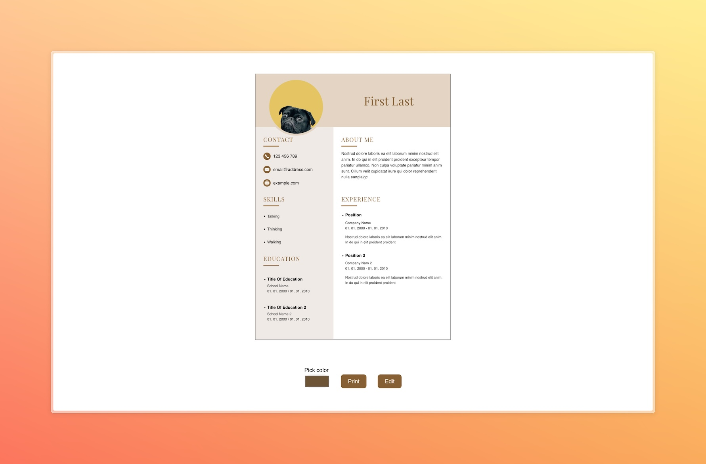
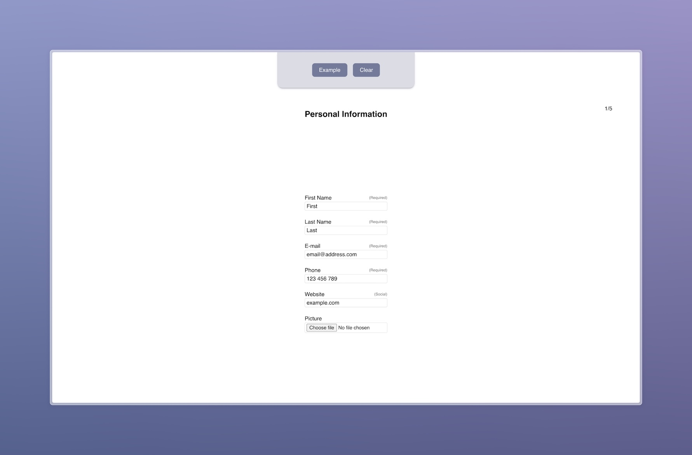
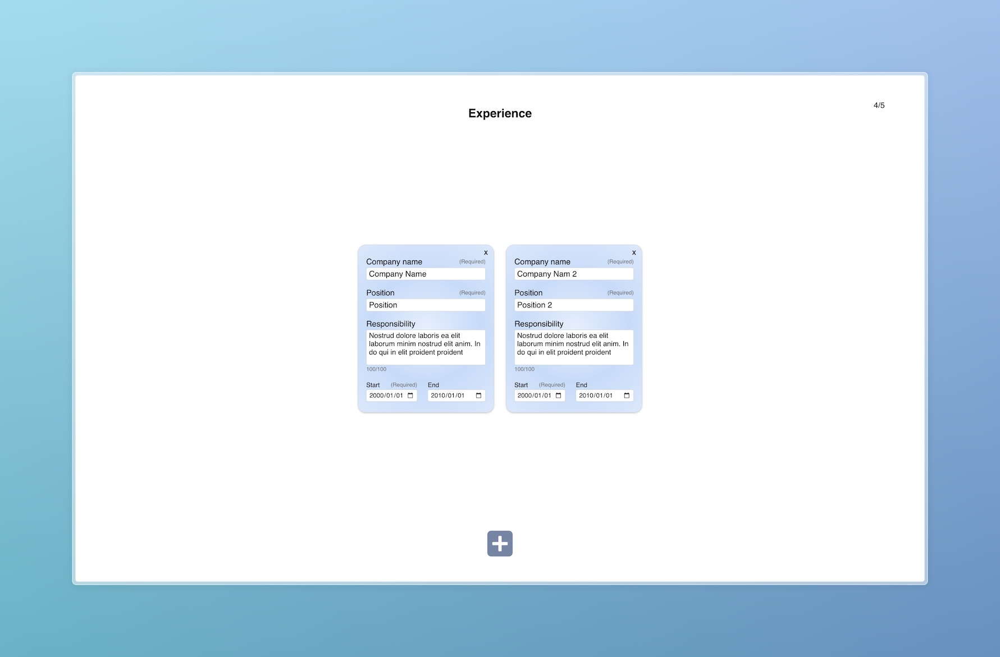

# JobReadyCV

## Table of Contents
- [JobReadyCV](#jobreadycv)
  - [Table of Contents](#table-of-contents)
  - [Description](#description)
  - [Screenshots](#screenshots)
  - [Features](#features)
    - [Live Demo](#live-demo)
  - [Technologies Used](#technologies-used)
  - [Credits](#credits)
  - [Contributing](#contributing)
  - [License](#license)

## Description
JobReadyCV is a simple and intuitive CV (Curriculum Vitae) generator.

Based on [Project: CV Application](https://www.theodinproject.com/lessons/node-path-react-new-cv-application) from [The Odin Project](https://www.theodinproject.com/) cubiculum.

Play around and let me know your opinions! 

## Screenshots

## Features
- **User-friendly Interface:** Easily fill out essential sections such as personal information, about me, education, and experience using a straightforward form.

- **Effortless CV Creation:** After completing the form, click the "Create" button to instantly generate a CV.

### Live Demo
👉🏻 [Live Demo](https://cv-application-liard-rho.vercel.app/)!
 
## Technologies Used

- React + Vite
- Date-fns
- Eslint
- uuid
- Normalize.css

## Credits
- [Icons8](https://icons8.com) for icons.
- [Unsplash](https://unsplash.com/) for background images.

## Contributing

Contributions are welcome! If you have any ideas for improvement, feel free to open an issue or submit a pull request.

## License

JobReadyCV is open-source software licensed under the [MIT License](LICENSE). 
Feel free to use, modify, and distribute it as per the terms of the license.